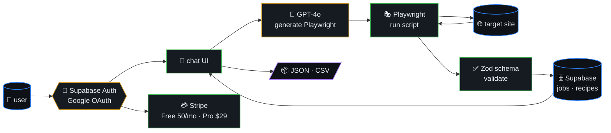
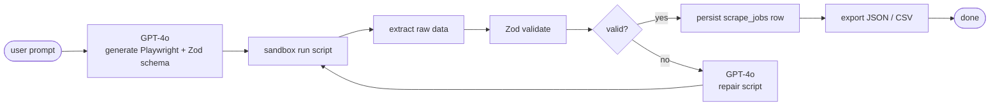
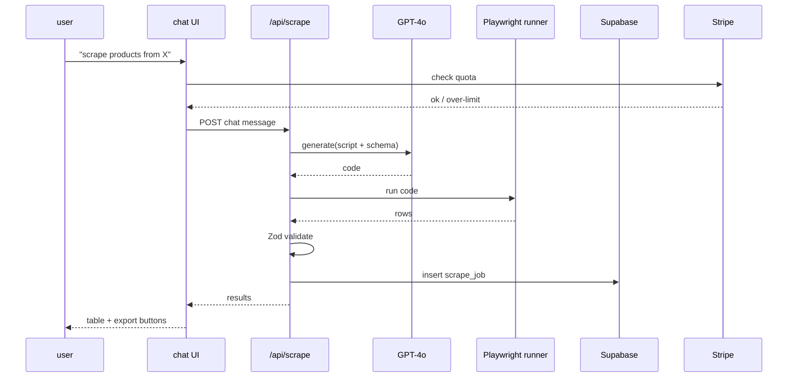
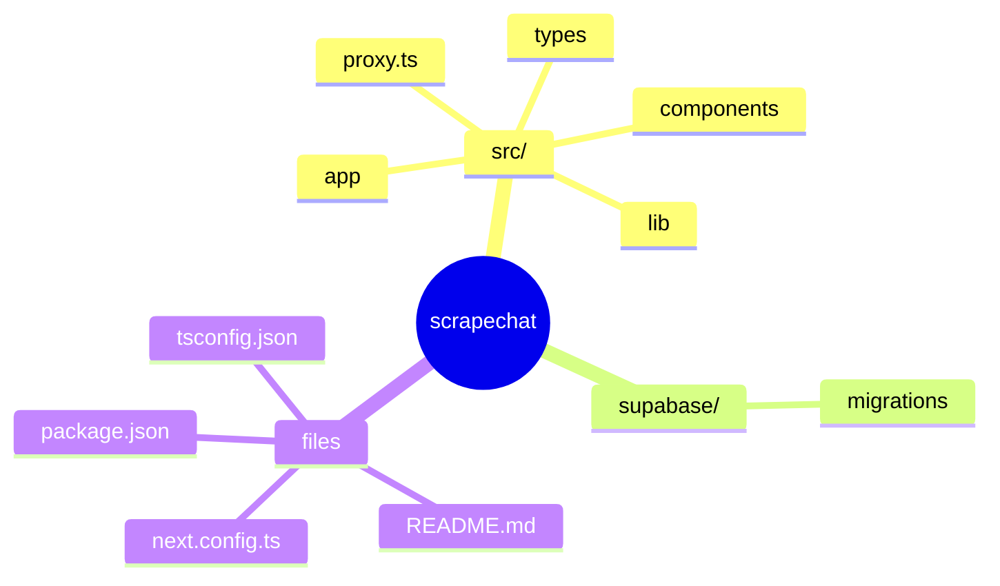

# ScrapeChatAI

> LLM-powered web scraper you chat with. Describe what you want to
> scrape in plain English — ScrapeChatAI generates Playwright scripts,
> validates output with Zod schemas, and returns clean structured data.



## Table of contents

- [Features](#features)
- [Scrape algorithm](#scrape-algorithm)
- [Chat-to-data sequence](#chat-to-data-sequence)
- [Tech Stack](#tech-stack)
- [Getting Started](#getting-started)
- [🗺️ Repository map](#️-repository-map)

## Scrape algorithm



## Chat-to-data sequence



## Features

- **Chat-based scraping** -- describe what you want in natural language
- **AI script generation** -- GPT-4o writes Playwright scripts for any site
- **Schema validation** -- Zod schemas validate every piece of scraped data
- **Export** -- download results as JSON or CSV
- **Reusable recipes** -- save scraping workflows for one-click re-runs
- **Stripe billing** -- Free tier (50 scrapes/mo) and Pro ($29/mo, unlimited)
- **Dark/light mode** -- system-aware theme with manual toggle
- **Mobile responsive** -- works on any device

## Tech Stack

- **Framework**: Next.js 16 (App Router)
- **Language**: TypeScript
- **Styling**: Tailwind CSS v4 + shadcn/ui
- **Auth**: Supabase (Google OAuth)
- **Database**: Supabase (PostgreSQL + RLS)
- **AI**: OpenAI GPT-4o
- **Billing**: Stripe (Checkout + Customer Portal + Webhooks)
- **Validation**: Zod

## Getting Started

### Prerequisites

- Node.js 18+
- A Supabase project with Google OAuth configured
- An OpenAI API key
- A Stripe account (for billing features)

### Setup

1. Clone and install:

```bash
git clone <repo-url>
cd scrapechat
npm install
```

2. Copy the environment file and fill in your keys:

```bash
cp .env.local.example .env.local
```

3. Set up the database -- run the SQL in `supabase/migrations/00001_create_tables.sql` in your Supabase SQL editor. This creates:
   - `profiles` table (extends auth.users with billing info)
   - `scrape_jobs` table (chat history + results)
   - `recipes` table (saved scraping workflows)
   - RLS policies (users can only access their own data)
   - Auto-create profile trigger on signup

4. Configure Supabase Auth:
   - Enable Google OAuth provider in Supabase Dashboard > Authentication > Providers
   - Add your site URL to the redirect URLs allow list

5. Configure Stripe (optional, for billing):
   - Create a product with a recurring price in Stripe Dashboard
   - Set `STRIPE_PRO_PRICE_ID` to the price ID
   - Set up a webhook endpoint pointing to `https://your-domain/api/webhooks/stripe`
   - Subscribe to events: `checkout.session.completed`, `customer.subscription.updated`, `customer.subscription.deleted`

6. Run the development server:

```bash
npm run dev
```

Open [http://localhost:3000](http://localhost:3000) in your browser.

### Environment Variables

| Variable | Required | Description |
|----------|----------|-------------|
| `NEXT_PUBLIC_SUPABASE_URL` | Yes | Supabase project URL |
| `NEXT_PUBLIC_SUPABASE_ANON_KEY` | Yes | Supabase anon/public key |
| `OPENAI_API_KEY` | Yes | OpenAI API key |
| `STRIPE_SECRET_KEY` | For billing | Stripe secret key |
| `STRIPE_WEBHOOK_SECRET` | For billing | Stripe webhook signing secret |
| `STRIPE_PRO_PRICE_ID` | For billing | Stripe Price ID for Pro plan |
| `NEXT_PUBLIC_STRIPE_PUBLISHABLE_KEY` | For billing | Stripe publishable key |
| `SUPABASE_SERVICE_ROLE_KEY` | For billing | Supabase service role key (webhooks) |
| `NEXT_PUBLIC_APP_URL` | For billing | Your app URL for redirects |

## Project Structure

```
src/
  app/
    page.tsx              # Landing page
    login/                # Google OAuth login
    chat/                 # Main scraping chat interface
    recipes/              # Saved scraping recipes
    settings/             # Account & billing settings
    api/
      scrape/             # AI script generation endpoint
      stripe/checkout/    # Stripe Checkout session
      stripe/portal/      # Stripe Customer Portal
      webhooks/stripe/    # Stripe webhook handler
      health/             # Health check endpoint
    auth/callback/        # OAuth callback handler
    error.tsx             # Error boundary
    not-found.tsx         # 404 page
    loading.tsx           # Global loading state
  components/
    chat/                 # Chat UI components
    ui/                   # shadcn/ui components
    navbar.tsx            # Landing page navbar
    theme-toggle.tsx      # Dark/light mode toggle
  lib/
    supabase/             # Supabase client (browser, server, middleware)
    stripe.ts             # Stripe client helper
    env.ts                # Environment variable validation
    utils.ts              # Utility functions
  types/
    chat.ts               # Chat message types
    database.ts           # Database table types
supabase/
  migrations/             # SQL migration files
```

## API Endpoints

| Endpoint | Method | Auth | Description |
|----------|--------|------|-------------|
| `/api/scrape` | POST | Yes | Generate scraping script via OpenAI |
| `/api/stripe/checkout` | GET | Yes | Create Stripe Checkout session |
| `/api/stripe/portal` | GET | Yes | Redirect to Stripe Customer Portal |
| `/api/webhooks/stripe` | POST | Stripe sig | Handle Stripe webhook events |
| `/api/health` | GET | No | Service health check |

## License

MIT


## 🗺️ Repository map

Top-level layout of `scrapechat` rendered as a Mermaid mindmap (auto-generated from the on-disk tree).


